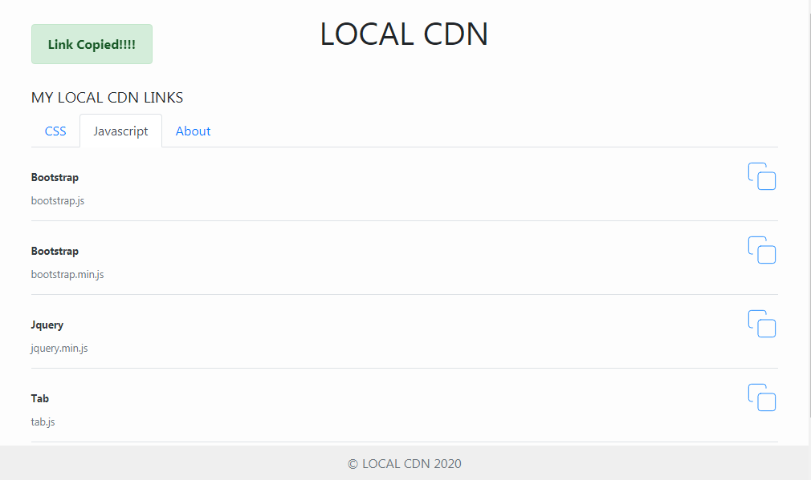

# STATIC PACKAGE

## What is static package ?

Static package is a simple web app for hosting most commonly used files ( packages ) on users local machine

## Who is static package for ?

Static package is mostly for frontend developers or developers that work on the frotend.

## Why static package ?

Most developers ( people like me ) when writing code or when downloading templates, we do download all css files and jquery files along. After downloading 7 templates which all have bootstrap in it, the user gets 7 bootstrap files. So with **STATIC PACKAGE**, you can run all the 7 templates with just one bootstrap file which pretends to be a bootstrap file from the cdn.

## Using static package ?
To get static packages, run  
>```git clone https://github.com/Qudusayo/static-package.git``` in your terminal  

Then  change directory to static packages
>```cd static-package```   

Install required packages by running  
> ```npm install```

To start up your server, run
> ```npm start```

## Updating your static package ?
You can easily update your packaged by moving your new file to the css folder or js folder  
**Quick Folder Structure**  
.  
├── static  
│   └── css   
│   └── jss   

# Usage
After downloading and starting the server, click on the copy symbol to copy the the link to any file.  
 